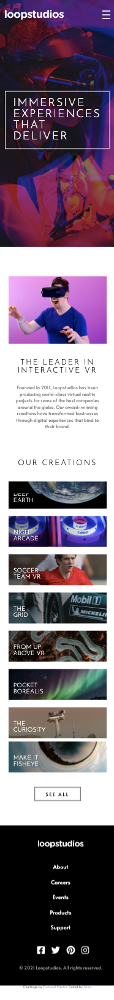

# Frontend Mentor - Loopstudios landing page solution

This is a solution to the [Loopstudios landing page challenge on Frontend Mentor](https://www.frontendmentor.io/challenges/loopstudios-landing-page-N88J5Onjw). Frontend Mentor challenges help you improve your coding skills by building realistic projects.

## Table of contents

-   [Overview](#overview)
    -   [The challenge](#the-challenge)
    -   [Screenshot](#screenshot)
    -   [Links](#links)
-   [My process](#my-process)
    -   [Built with](#built-with)
    -   [What I learned](#what-i-learned)
    -   [Continued development](#continued-development)
    -   [Useful resources](#useful-resources)
-   [Author](#author)

## Overview

### The challenge

Users should be able to:

-   View the optimal layout for the site depending on their device's screen size
-   See hover states for all interactive elements on the page

### Screenshot




### Links

-   Solution URL: [https://github.com/akiraafu/loopstudios-landing-page]
-   Live Site URL: [https://akiraafu.github.io/loopstudios-landing-page/]

## My process

### Built with

-   Semantic HTML5 markup
-   CSS custom properties
-   Sass/Scss
-   CSS Grid
-   Mobile-first workflow
-   JavaScript

### What I learned

```css
.proud-of-this-css {
    .navMenu {
        display: none;
        &.mobile-show {
            grid-column-start: 1;
            grid-column-end: 2;
            grid-row-start: 2;
            grid-row-end: 3;
            display: grid;
            grid-template-columns: 1fr;
            margin-top: 10rem;
            li {
                text-align: start;
                margin-bottom: 8px;
            }
            a {
                font-family: "Josefin Sans", sans-serif;
                text-transform: uppercase;
                font-size: 25px;
            }
        }
    }
}
```

### Continued development

none

### Useful resources

-   [MDN](https://developer.mozilla.org/en-US/)
-   [Youtube @Traversy Media](https://www.youtube.com/watch?v=nu5mdN2JIwM)

## Author

-   Website - [akiraafu](https://github.com/akiraafu)
-   Frontend Mentor - [@akiraafu](https://www.frontendmentor.io/profile/akiraafu)
